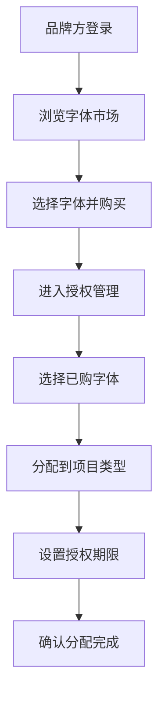
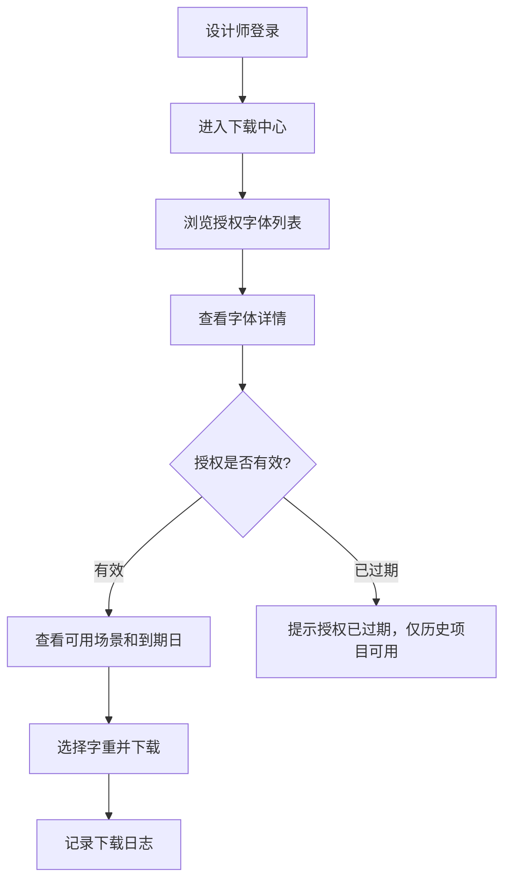
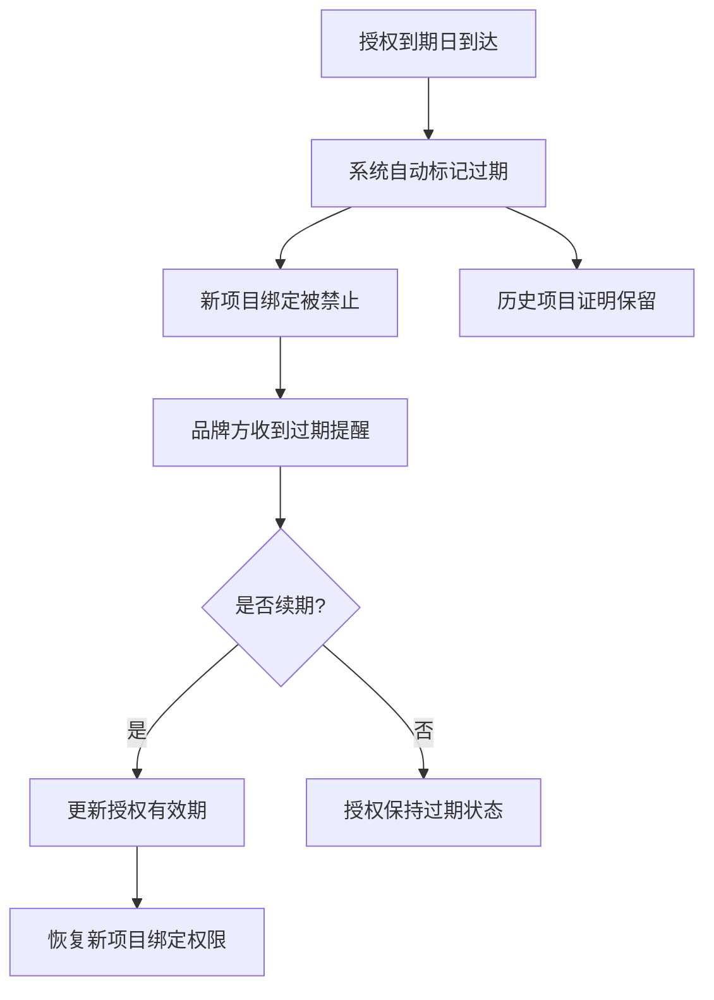

## 1. 产品概述

字体授权管理系统是一个面向品牌方和设计师的在线字体版权管理平台，解决字体授权分配、使用追踪和合规证明等核心问题。品牌方可以为不同项目类型分配授权范围，设计师下载字体时清晰了解使用场景和有效期，授权过期后自动限制新项目使用但保留历史证明。

### 1.1 核心价值
- 简化字体授权管理流程，降低版权风险
- 实现授权使用的全生命周期追踪
- 保障历史项目的合规性证明可追溯

---

## 2. 核心功能

### 2.1 用户角色

| 角色 | 登录方式 | 核心权限 |
|------|----------|----------|
| 品牌方管理员 | 账号密码登录 | 购买字体、管理授权、分配项目权限、查看使用统计、导出授权证明 |
| 设计师 | 账号密码登录 | 浏览授权字体、查看使用场景和到期日、下载字体、查看历史项目证明 |

### 2.2 功能模块

1. **登录页**：用户身份认证、角色切换、记住登录状态
2. **仪表盘**：授权概览、即将过期提醒、使用统计、快捷操作
3. **字体市场**：字体列表浏览、字体详情、购买授权
4. **授权管理**：已购字体列表、授权详情、项目分配、到期管理
5. **项目管理**：项目列表、项目类型（官网/App/包装/广告）、授权绑定、历史证明
6. **字体下载**：字体预览、可用场景展示、到期日提醒、下载操作
7. **授权证明**：历史项目列表、授权证书查看、导出证明文件

### 2.3 页面详情

| 页面名称 | 模块名称 | 功能描述 |
|-----------|-------------|---------------------|
| 登录页 | 登录表单 | 账号密码输入、角色选择、登录验证、错误提示 |
| 仪表盘 | 统计卡片 | 总授权数、即将过期数、活跃项目数、本月下载量 |
| 仪表盘 | 授权概览 | 按类型展示授权分布饼图、近期活动时间线 |
| 字体市场 | 字体列表 | 字体卡片展示、筛选（字重/风格/语言）、搜索 |
| 字体市场 | 字体详情 | 字体预览、字重选择、授权套餐展示、购买操作 |
| 授权管理 | 授权列表 | 已购字体、授权状态筛选、批量操作 |
| 授权管理 | 授权详情 | 授权信息展示、项目分配、到期日期调整 |
| 项目管理 | 项目列表 | 项目卡片、类型标签、授权状态、操作按钮 |
| 项目管理 | 新建项目 | 项目信息填写、字体授权选择、授权范围确认 |
| 项目管理 | 项目详情 | 项目信息、绑定字体、授权证明、历史记录 |
| 字体下载 | 下载中心 | 可下载字体列表、场景标签、到期日展示 |
| 字体下载 | 字体预览 | 字体渲染预览、字重切换、字符集展示 |
| 授权证明 | 证明列表 | 历史项目、授权状态、有效期、导出按钮 |
| 授权证明 | 证明详情 | 授权证书展示、项目信息、法律声明、下载PDF |

---

## 3. 核心流程

### 3.1 品牌方授权分配流程

品牌方登录 → 浏览字体市场 → 购买字体授权 → 进入授权管理 → 选择已购字体 → 分配到具体项目（官网/App/包装/广告）→ 设置授权期限 → 确认分配

### 3.2 设计师下载字体流程

设计师登录 → 进入下载中心 → 浏览授权字体 → 查看可用场景和到期日 → 选择字体和字重 → 确认授权范围 → 下载字体文件

### 3.3 授权过期处理流程

授权到期 → 系统自动标记为过期 → 新项目无法绑定该授权 → 历史项目保留授权证明 → 品牌方可续期授权 → 续期后恢复使用

---

## 4. 用户界面设计

### 4.1 设计风格

**设计方向**：专业、精致、高端的 B 端管理系统风格，融合字体设计的艺术感

- **主色调**：深墨蓝 `#1a1a2e`，代表专业与信任
- **辅助色**：金色 `#d4af37`，代表品质与价值
- **强调色**：珊瑚红 `#e94560`，用于过期提醒和重要操作
- **成功色**：森林绿 `#2d6a4f`，用于有效状态标识
- **中性色**：以炭灰 `#16213e` 为底色，搭配多级灰度

- **按钮风格**：圆角 4px，简约精致，悬停时带有微妙的阴影和颜色渐变
- **字体选择**：
  - 标题：使用优雅的衬线字体（Playfair Display）展现字体行业特质
  - 正文：使用现代无衬线字体（Inter）确保可读性
  - 数字和标签：使用等宽字体（JetBrains Mono）

- **布局风格**：侧边导航 + 主内容区的经典管理后台布局，卡片式内容展示，层次分明
- **图标风格**：线性图标为主，关键操作使用填充图标，保持简洁专业

### 4.2 页面设计概述

| 页面名称 | 模块名称 | UI 元素 |
|-----------|-------------|-------------|
| 登录页 | 登录表单 | 左侧品牌展示区（字体样张动态展示）、右侧登录表单、深色背景配金色点缀、渐入动画 |
| 仪表盘 | 统计卡片 | 四个彩色统计卡片、悬停上浮效果、数据变化微动画、网格布局 |
| 仪表盘 | 授权概览 | 环形图展示授权类型分布、时间线展示近期活动、卡片阴影分层 |
| 字体市场 | 字体列表 | 瀑布流卡片布局、字体样张预览、悬停放大效果、金色边框高亮选中状态 |
| 字体市场 | 字体详情 | 大号字体预览区、字重选择器、授权套餐对比表格、购买按钮动效 |
| 授权管理 | 授权列表 | 表格视图、状态标签（有效/即将过期/已过期）、筛选栏、分页 |
| 授权管理 | 授权详情 | 信息分组展示、项目多选分配器、日期选择器、操作确认弹窗 |
| 项目管理 | 项目列表 | 卡片网格布局、类型图标标签、进度条展示授权有效期、快捷操作菜单 |
| 项目管理 | 新建项目 | 表单向导、步骤指示器、实时授权范围预览、确认弹窗 |
| 字体下载 | 下载中心 | 列表视图、场景标签组、到期日倒计时、下载按钮组 |
| 字体下载 | 字体预览 | 可编辑预览文本、字重切换、字符表展示、缩放控制 |
| 授权证明 | 证明列表 | 时间线布局、证书缩略图、状态徽章、导出按钮 |
| 授权证明 | 证明详情 | 仿证书样式设计、防伪纹理、数字签名展示、打印样式优化 |

### 4.3 响应式设计

- **桌面端优先**：主内容区最小宽度 1200px，侧边栏固定宽度 260px
- **平板适配**：侧边栏可折叠为图标模式，主内容区自适应
- **移动适配**：顶部导航替代侧边栏，卡片堆叠布局，优化触控区域
- **触控优化**：按钮最小高度 44px，合理间距避免误触

### 4.4 微交互与动效

- **页面加载**：骨架屏渐进式加载，内容区块交错淡入
- **卡片悬停**：轻微上浮（translateY -4px），阴影加深
- **按钮交互**：点击时缩放 0.96，过渡时长 150ms
- **状态变化**：成功/失败状态使用 Toast 通知，带滑入动画
- **数据更新**：数字变化使用滚动计数动画
- **模态弹窗**：背景模糊 + 缩放进入效果
