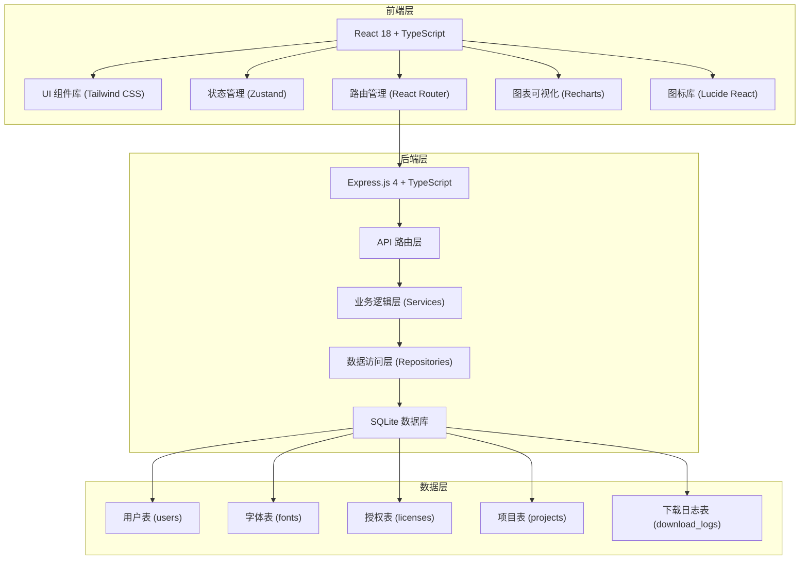
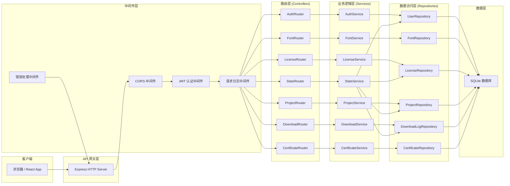
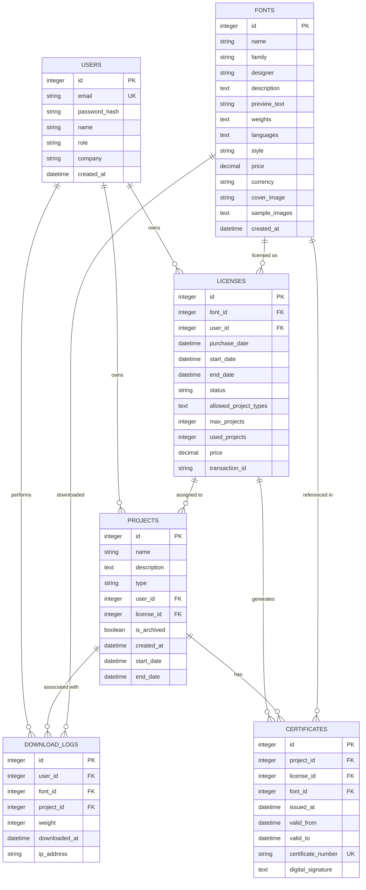

## 1. 架构设计



---

## 2. 技术描述

### 2.1 技术栈选型

- **前端框架**: React@18.2.0 + TypeScript@5.3.0
- **构建工具**: Vite@5.0.0
- **样式方案**: Tailwind CSS@3.4.0
- **状态管理**: Zustand@4.4.0
- **路由管理**: React Router DOM@6.20.0
- **图表库**: Recharts@2.10.0
- **图标库**: Lucide React@0.294.0
- **HTTP 客户端**: Axios@1.6.0

- **后端框架**: Express@4.18.0 + TypeScript@5.3.0
- **数据库**: SQLite3（内置，无需额外服务）
- **ORM**: 原生 SQL + 参数化查询
- **认证**: JWT (jsonwebtoken@9.0.0)
- **密码加密**: bcryptjs@2.4.0

### 2.2 项目初始化

- **初始化工具**: `pnpm create vite-init@latest . --template react-express-ts --force`
- **包管理器**: pnpm（优先）或 npm
- **代码规范**: ESLint + Prettier
- **类型检查**: TypeScript 严格模式

---

## 3. 路由定义

### 3.1 前端路由

| 路由路径 | 页面名称 | 权限角色 | 说明 |
|---------|---------|----------|------|
| `/login` | 登录页 | 公开 | 用户登录入口 |
| `/dashboard` | 仪表盘 | 品牌方/设计师 | 数据概览和快捷操作 |
| `/market` | 字体市场 | 品牌方 | 浏览和购买字体 |
| `/market/:id` | 字体详情 | 品牌方 | 字体详情和购买操作 |
| `/licenses` | 授权管理 | 品牌方 | 已购授权列表和管理 |
| `/licenses/:id` | 授权详情 | 品牌方 | 授权详情和项目分配 |
| `/projects` | 项目管理 | 品牌方/设计师 | 项目列表管理 |
| `/projects/new` | 新建项目 | 品牌方 | 创建新项目并绑定授权 |
| `/projects/:id` | 项目详情 | 品牌方/设计师 | 项目详情和授权证明 |
| `/downloads` | 字体下载 | 设计师 | 可下载字体列表 |
| `/downloads/:id` | 字体预览 | 设计师 | 字体预览和下载 |
| `/certificates` | 授权证明 | 品牌方/设计师 | 历史项目授权证书 |
| `/certificates/:id` | 证明详情 | 品牌方/设计师 | 证书详情和导出 |

### 3.2 API 路由

| 方法 | 路由 | 模块 | 说明 |
|------|------|------|------|
| POST | `/api/auth/login` | 认证 | 用户登录 |
| GET | `/api/auth/profile` | 认证 | 获取当前用户信息 |
| GET | `/api/fonts` | 字体 | 获取字体列表 |
| GET | `/api/fonts/:id` | 字体 | 获取字体详情 |
| POST | `/api/fonts/:id/purchase` | 字体 | 购买字体授权 |
| GET | `/api/licenses` | 授权 | 获取用户授权列表 |
| GET | `/api/licenses/:id` | 授权 | 获取授权详情 |
| PUT | `/api/licenses/:id` | 授权 | 更新授权信息（分配项目等） |
| POST | `/api/licenses/:id/renew` | 授权 | 续期授权 |
| GET | `/api/projects` | 项目 | 获取项目列表 |
| POST | `/api/projects` | 项目 | 创建新项目 |
| GET | `/api/projects/:id` | 项目 | 获取项目详情 |
| GET | `/api/downloads` | 下载 | 获取可下载字体列表 |
| GET | `/api/downloads/:id` | 下载 | 获取下载字体详情 |
| POST | `/api/downloads/:id` | 下载 | 下载字体并记录日志 |
| GET | `/api/certificates` | 证明 | 获取授权证明列表 |
| GET | `/api/certificates/:id` | 证明 | 获取证明详情 |
| GET | `/api/certificates/:id/export` | 证明 | 导出证明文件 |
| GET | `/api/stats/dashboard` | 统计 | 获取仪表盘统计数据 |

---

## 4. API 定义

### 4.1 类型定义

```typescript
// 共享类型定义 (shared/types.ts)

export type UserRole = 'brand' | 'designer';

export type LicenseStatus = 'active' | 'expiring' | 'expired';

export type ProjectType = 'website' | 'app' | 'packaging' | 'advertising';

export interface User {
  id: number;
  email: string;
  name: string;
  role: UserRole;
  company?: string;
  createdAt: string;
}

export interface Font {
  id: number;
  name: string;
  family: string;
  designer: string;
  description: string;
  previewText: string;
  weights: number[];
  languages: string[];
  style: 'serif' | 'sans-serif' | 'display' | 'monospace';
  price: number;
  currency: string;
  coverImage: string;
  sampleImages: string[];
  createdAt: string;
}

export interface License {
  id: number;
  fontId: number;
  font?: Font;
  userId: number;
  purchaseDate: string;
  startDate: string;
  endDate: string;
  status: LicenseStatus;
  allowedProjectTypes: ProjectType[];
  maxProjects: number;
  usedProjects: number;
  price: number;
  transactionId: string;
}

export interface Project {
  id: number;
  name: string;
  description: string;
  type: ProjectType;
  userId: number;
  licenseId: number;
  license?: License;
  isArchived: boolean;
  createdAt: string;
  startDate: string;
  endDate?: string;
}

export interface DownloadLog {
  id: number;
  userId: number;
  fontId: number;
  projectId: number;
  weight: number;
  downloadedAt: string;
  ipAddress: string;
}

export interface Certificate {
  id: number;
  projectId: number;
  project?: Project;
  licenseId: number;
  license?: License;
  fontId: number;
  font?: Font;
  issuedAt: string;
  validFrom: string;
  validTo: string;
  certificateNumber: string;
  digitalSignature: string;
}

export interface DashboardStats {
  totalLicenses: number;
  activeLicenses: number;
  expiringLicenses: number;
  expiredLicenses: number;
  totalProjects: number;
  activeProjects: number;
  monthlyDownloads: number;
  totalDownloads: number;
  licenseByType: Record<ProjectType, number>;
  recentActivities: ActivityItem[];
}

export interface ActivityItem {
  id: number;
  type: 'purchase' | 'download' | 'project_create' | 'license_expire';
  description: string;
  timestamp: string;
  metadata: Record<string, any>;
}
```

### 4.2 请求/响应模式

```typescript
// 登录请求
interface LoginRequest {
  email: string;
  password: string;
  role: UserRole;
}

interface LoginResponse {
  token: string;
  user: User;
}

// 通用响应
interface ApiResponse<T> {
  success: boolean;
  data: T;
  message?: string;
  error?: string;
}

// 分页响应
interface PaginatedResponse<T> {
  success: boolean;
  data: T[];
  pagination: {
    page: number;
    pageSize: number;
    total: number;
    totalPages: number;
  };
}
```

---

## 5. 服务器架构图



---

## 6. 数据模型

### 6.1 ER 图



### 6.2 DDL 语句

```sql
-- 用户表
CREATE TABLE IF NOT EXISTS users (
  id INTEGER PRIMARY KEY AUTOINCREMENT,
  email VARCHAR(255) UNIQUE NOT NULL,
  password_hash VARCHAR(255) NOT NULL,
  name VARCHAR(100) NOT NULL,
  role VARCHAR(20) NOT NULL CHECK (role IN ('brand', 'designer')),
  company VARCHAR(255),
  created_at DATETIME DEFAULT CURRENT_TIMESTAMP
);

-- 字体表
CREATE TABLE IF NOT EXISTS fonts (
  id INTEGER PRIMARY KEY AUTOINCREMENT,
  name VARCHAR(100) NOT NULL,
  family VARCHAR(100) NOT NULL,
  designer VARCHAR(100) NOT NULL,
  description TEXT,
  preview_text TEXT DEFAULT 'The quick brown fox jumps over the lazy dog',
  weights TEXT NOT NULL,
  languages TEXT NOT NULL,
  style VARCHAR(50) NOT NULL CHECK (style IN ('serif', 'sans-serif', 'display', 'monospace')),
  price DECIMAL(10, 2) NOT NULL,
  currency VARCHAR(3) DEFAULT 'CNY',
  cover_image VARCHAR(255),
  sample_images TEXT,
  created_at DATETIME DEFAULT CURRENT_TIMESTAMP
);

-- 授权表
CREATE TABLE IF NOT EXISTS licenses (
  id INTEGER PRIMARY KEY AUTOINCREMENT,
  font_id INTEGER NOT NULL REFERENCES fonts(id),
  user_id INTEGER NOT NULL REFERENCES users(id),
  purchase_date DATETIME DEFAULT CURRENT_TIMESTAMP,
  start_date DATETIME NOT NULL,
  end_date DATETIME NOT NULL,
  status VARCHAR(20) NOT NULL DEFAULT 'active' CHECK (status IN ('active', 'expiring', 'expired')),
  allowed_project_types TEXT NOT NULL,
  max_projects INTEGER NOT NULL DEFAULT 1,
  used_projects INTEGER NOT NULL DEFAULT 0,
  price DECIMAL(10, 2) NOT NULL,
  transaction_id VARCHAR(100) UNIQUE NOT NULL,
  CHECK (start_date < end_date)
);

-- 项目表
CREATE TABLE IF NOT EXISTS projects (
  id INTEGER PRIMARY KEY AUTOINCREMENT,
  name VARCHAR(200) NOT NULL,
  description TEXT,
  type VARCHAR(50) NOT NULL CHECK (type IN ('website', 'app', 'packaging', 'advertising')),
  user_id INTEGER NOT NULL REFERENCES users(id),
  license_id INTEGER NOT NULL REFERENCES licenses(id),
  is_archived BOOLEAN DEFAULT 0,
  created_at DATETIME DEFAULT CURRENT_TIMESTAMP,
  start_date DATETIME NOT NULL,
  end_date DATETIME
);

-- 下载日志表
CREATE TABLE IF NOT EXISTS download_logs (
  id INTEGER PRIMARY KEY AUTOINCREMENT,
  user_id INTEGER NOT NULL REFERENCES users(id),
  font_id INTEGER NOT NULL REFERENCES fonts(id),
  project_id INTEGER NOT NULL REFERENCES projects(id),
  weight INTEGER NOT NULL,
  downloaded_at DATETIME DEFAULT CURRENT_TIMESTAMP,
  ip_address VARCHAR(45)
);

-- 授权证明表
CREATE TABLE IF NOT EXISTS certificates (
  id INTEGER PRIMARY KEY AUTOINCREMENT,
  project_id INTEGER NOT NULL REFERENCES projects(id),
  license_id INTEGER NOT NULL REFERENCES licenses(id),
  font_id INTEGER NOT NULL REFERENCES fonts(id),
  issued_at DATETIME DEFAULT CURRENT_TIMESTAMP,
  valid_from DATETIME NOT NULL,
  valid_to DATETIME NOT NULL,
  certificate_number VARCHAR(50) UNIQUE NOT NULL,
  digital_signature TEXT NOT NULL
);

-- 创建索引
CREATE INDEX IF NOT EXISTS idx_licenses_user_id ON licenses(user_id);
CREATE INDEX IF NOT EXISTS idx_licenses_font_id ON licenses(font_id);
CREATE INDEX IF NOT EXISTS idx_licenses_status ON licenses(status);
CREATE INDEX IF NOT EXISTS idx_projects_user_id ON projects(user_id);
CREATE INDEX IF NOT EXISTS idx_projects_license_id ON projects(license_id);
CREATE INDEX IF NOT EXISTS idx_projects_type ON projects(type);
CREATE INDEX IF NOT EXISTS idx_download_logs_user_id ON download_logs(user_id);
CREATE INDEX IF NOT EXISTS idx_download_logs_font_id ON download_logs(font_id);
CREATE INDEX IF NOT EXISTS idx_certificates_project_id ON certificates(project_id);
CREATE INDEX IF NOT EXISTS idx_certificates_certificate_number ON certificates(certificate_number);
```

### 6.3 初始种子数据

```sql
-- 初始用户
INSERT INTO users (email, password_hash, name, role, company) VALUES
('brand@example.com', '$2a$10$...', '品牌方管理员', 'brand', '某知名品牌公司'),
('designer@example.com', '$2a$10$...', '张设计师', 'designer', '某设计工作室');

-- 初始字体数据
INSERT INTO fonts (name, family, designer, description, weights, languages, style, price, cover_image) VALUES
('Montserrat Regular', 'Montserrat', 'Julieta Ulanovsky', '一款现代几何无衬线字体，适合标题和正文使用。', '[300, 400, 500, 600, 700, 800, 900]', '["中文", "英文", "日文"]', 'sans-serif', 2999.00, '/images/fonts/montserrat.jpg'),
('Playfair Display', 'Playfair Display', 'Claus Eggers Sørensen', '优雅的过渡衬线字体，具有高对比度和精致的衬线。', '[400, 500, 600, 700, 800, 900]', '["中文", "英文"]', 'serif', 3999.00, '/images/fonts/playfair.jpg'),
('JetBrains Mono', 'JetBrains Mono', 'JetBrains', '专为开发者设计的等宽字体，具有清晰的字符辨识度。', '[100, 200, 300, 400, 500, 600, 700, 800]', '["英文"]', 'monospace', 1999.00, '/images/fonts/jetbrains.jpg'),
('Bebas Neue', 'Bebas Neue', 'Ryoichi Tsunekawa', '大胆的无衬线字体，非常适合大标题和海报设计。', '[400]', '["英文"]', 'display', 1599.00, '/images/fonts/bebas.jpg'),
('Noto Serif SC', 'Noto Serif SC', 'Google', '谷歌推出的开源中文衬线字体，覆盖完整的中文简体字符集。', '[200, 300, 400, 500, 600, 700, 900]', '["中文", "英文"]', 'serif', 4999.00, '/images/fonts/noto-serif.jpg');

-- 初始授权数据
INSERT INTO licenses (font_id, user_id, start_date, end_date, status, allowed_project_types, max_projects, used_projects, price, transaction_id) VALUES
(1, 1, '2025-01-01 00:00:00', '2026-12-31 23:59:59', 'active', '["website", "app", "advertising"]', 10, 3, 2999.00, 'TXN202501010001'),
(2, 1, '2025-06-01 00:00:00', '2025-12-31 23:59:59', 'expiring', '["packaging", "advertising"]', 5, 2, 3999.00, 'TXN202506010002'),
(3, 1, '2024-01-01 00:00:00', '2024-12-31 23:59:59', 'expired', '["website"]', 3, 2, 1999.00, 'TXN202401010003');

-- 初始项目数据
INSERT INTO projects (name, description, type, user_id, license_id, start_date, end_date) VALUES
('品牌官网改版', '2025年度品牌官方网站全面升级项目', 'website', 1, 1, '2025-03-01 00:00:00', '2025-09-30 23:59:59'),
('移动端 App 设计', 'iOS 和 Android 双端应用界面设计项目', 'app', 1, 1, '2025-04-15 00:00:00', NULL),
('夏季促销活动', '2025年夏季促销广告活动视觉设计', 'advertising', 1, 1, '2025-06-01 00:00:00', '2025-08-31 23:59:59'),
('节日礼盒包装', '2025年节日限定产品包装设计', 'packaging', 1, 2, '2025-09-01 00:00:00', '2025-12-25 23:59:59'),
('线下广告牌', '城市核心商圈户外广告牌设计', 'advertising', 1, 2, '2025-07-01 00:00:00', '2025-10-31 23:59:59'),
('历史官网项目', '2024年旧版官网项目（历史存档）', 'website', 1, 3, '2024-03-01 00:00:00', '2024-12-31 23:59:59');

-- 初始授权证明
INSERT INTO certificates (project_id, license_id, font_id, valid_from, valid_to, certificate_number, digital_signature) VALUES
(1, 1, 1, '2025-03-01 00:00:00', '2026-12-31 23:59:59', 'CERT-20250301-0001', 'SIG-0x1a2b3c4d5e6f7a8b9c0d...'),
(2, 1, 1, '2025-04-15 00:00:00', '2026-12-31 23:59:59', 'CERT-20250415-0002', 'SIG-0x2b3c4d5e6f7a8b9c0d1e...'),
(3, 1, 1, '2025-06-01 00:00:00', '2026-12-31 23:59:59', 'CERT-20250601-0003', 'SIG-0x3c4d5e6f7a8b9c0d1e2f...'),
(4, 2, 2, '2025-09-01 00:00:00', '2025-12-31 23:59:59', 'CERT-20250901-0004', 'SIG-0x4d5e6f7a8b9c0d1e2f3a...'),
(5, 2, 2, '2025-07-01 00:00:00', '2025-12-31 23:59:59', 'CERT-20250701-0005', 'SIG-0x5e6f7a8b9c0d1e2f3a4b...'),
(6, 3, 3, '2024-03-01 00:00:00', '2024-12-31 23:59:59', 'CERT-20240301-0006', 'SIG-0x6f7a8b9c0d1e2f3a4b5c...');

-- 初始下载日志
INSERT INTO download_logs (user_id, font_id, project_id, weight, ip_address) VALUES
(2, 1, 1, 400, '192.168.1.101'),
(2, 1, 1, 700, '192.168.1.101'),
(2, 1, 2, 400, '192.168.1.102'),
(2, 1, 2, 600, '192.168.1.102'),
(2, 2, 4, 700, '192.168.1.103');
```
